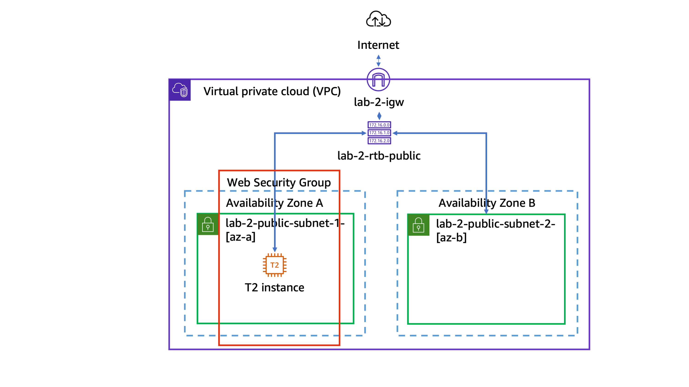

# Lab 2: Creating a VPC and Launching a Web Application in an Amazon EC2 Instance

## **Date:** 23/2/2025 
## **Author:** Marrio Hinkle  
## **Platform:** AWS Training & Certification  

---

## **Objective**
This lab involved setting up a **Virtual Private Cloud (VPC)**, launching an **EC2 instance**, and configuring it to host a web application using a **user data script**.

---

## **Key Tasks Performed**

### **1. VPC Setup:**
- Created a new **VPC** with **CIDR block `10.0.0.0/16`**.
- Configured **two public subnets** across different Availability Zones.
- Set up an **Internet Gateway** and attached it to the VPC.
- Created and configured a **Route Table** to allow internet access.

### **2. Security Configuration:**
- Created a **Security Group** allowing inbound **HTTP traffic (port 80)** from anywhere.
- Configured outbound rules to allow all outbound traffic.

### **3. EC2 Instance Deployment:**
- Launched an **Amazon Linux 2023 EC2 instance (`t3.micro`)**.
- Assigned the instance to the **public subnet** with an auto-assigned public IP.
- Associated the **Web Security Group** with the instance.
- Used **user data script** to automate:
  - Installation of **Node.js** using NVM.
  - Deployment of a web application from an **S3 bucket**.
  - Application launch.

### **4. Validation & Testing:**
- Verified **instance status** and **public IP**.
- Successfully accessed the **web application** in a browser.

---

## **Key Takeaways**
✅ **Networking:** Gained hands-on experience with **VPC, subnets, and routing tables**.  
✅ **Security:** Configured **Security Groups** to restrict access.  
✅ **Automation:** Used **user data scripts** to automate software installation and app deployment.  
✅ **EC2 Instance Management:** Launched and configured an instance efficiently.  

---

## **Challenges & Resolutions**
- **Challenge:** Ensuring the public IP was accessible via HTTP.  
  - **Solution:** Verified Security Group settings and ensured the public IP was correct.  
- **Challenge:** Web application not starting immediately.  
  - **Solution:** Checked **user data script logs** via EC2 instance system logs.  

---

## **Next Steps**
- Experiment with **private subnets and NAT Gateway** for private EC2 instances.
- Automate the deployment using **AWS CloudFormation** or **Terraform**.
- Implement **IAM roles** for better security management.

---

## Lab Diagram

---

## **Conclusion**
This lab provided foundational skills in **AWS networking, EC2 instance management, and automation using user data scripts**. These skills are crucial for **cloud infrastructure design and deployment**.

---
