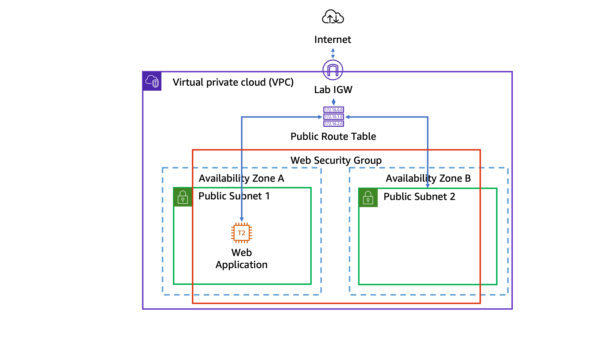

# Lab 3: Configuring Amazon S3 and DynamoDB for an Employee Directory Application

**Date:** 10/3/2025  
**Author:** Marrio Hinkle  
**Platform:** AWS Training & Certification  

## **Objective**
This lab focused on configuring **Amazon S3** and **Amazon DynamoDB** to support an **Employee Directory Web Application** hosted on an **Amazon EC2 instance**.

---

## **Key Tasks Performed**

### **1. Amazon S3 Bucket Creation**
- Created an **Amazon S3 bucket** named `employee-photo-bucket-mh-0212`.
- Ensured the bucket was created in the specified **AWS region**.
- Kept the **Block all public access** setting enabled to restrict unauthorized access.

### **2. S3 Bucket Policy Configuration**
- Assigned a **bucket policy** to allow the **EmployeeDirectoryAppRole IAM role** to access the bucket.
- Configured the policy to allow **read access** for objects inside the bucket.
- Used the **AWSAccountID** to properly define the **IAM role ARN**.

### **3. Configuring the Employee Directory Application to Use S3**
- Accessed the **Employee Directory web application**.
- Navigated to **Administration > Configuration**.
- Updated the **S3 Bucket field** to the newly created **S3 bucket name**.
- Verified that the **S3 Access Enabled** status was updated.

### **4. Uploading Employee Images to Amazon S3**
- Downloaded a **sample image archive** from a provided URL.
- Extracted **10 `.png` images** from the compressed file.
- Uploaded all images to the **S3 bucket** using the AWS S3 console.
- Verified the **successful upload** and confirmed image availability.

### **5. Creating an Amazon DynamoDB Table**
- Created a **DynamoDB table** named `Employees`.
- Defined **id (String)** as the **Partition Key**.
- Ensured the table status changed to **Active** before proceeding.

### **6. Testing the Employee Directory Application**
- Refreshed the **Employee Directory application**.
- Verified that the **DynamoDB error disappeared**, confirming successful connection.
- Added a new employee record by providing:
  - **Name, Location, Email**
  - **Selected an existing employee image**
- Confirmed that the new employee appeared in the directory.

### **7. Managing Existing Employee Records in DynamoDB**
- Opened **DynamoDB > Employees table**.
- Used **Explore table items** to view employee records.
- Edited existing **employee attributes** like location and email.
- Verified the changes by refreshing the **Employee Directory application**.

### **8. Creating Employee Records in DynamoDB via AWS Console**
- Created a **new employee record** manually using the **DynamoDB console**.
- Provided:
  - **id (String), name, location, email, photo**
- Saved the new record and confirmed it appeared in the web application.

---

## **Key Takeaways**
✅ **S3 Management:** Created and configured an **Amazon S3 bucket** with appropriate policies.  
✅ **IAM & Security:** Configured **bucket policies** to restrict access to authorized IAM roles.  
✅ **DynamoDB Integration:** Created a database table and successfully integrated it with the web application.  
✅ **Application Configuration:** Configured the **Employee Directory App** to retrieve images from **S3** and employee records from **DynamoDB**.  
✅ **Data Management:** Used **DynamoDB console** to add, edit, and delete employee records.  

---

## **Challenges & Resolutions**
**Challenge:** The Employee Directory application could not access S3.  
**Solution:** Verified and updated the **S3 bucket policy** to allow IAM role access.  

**Challenge:** Web application was not displaying newly uploaded images.  
**Solution:** Confirmed that images were properly uploaded to **S3** and ensured the correct **bucket name** was configured in the application settings.  

---

## **Next Steps**
- Automate the **S3 bucket creation and policy assignment** using **AWS CLI or CloudFormation**.
- Implement **IAM role restrictions** for better security control.
- Extend the **DynamoDB schema** to include additional employee attributes.

---

## **Lab Diagram**

---

## **Conclusion**
This lab provided hands-on experience with **AWS S3 and DynamoDB** for cloud application storage and data management. Understanding these services is essential for **scalable and secure cloud-based applications**.

